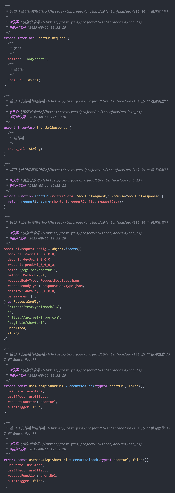

<p align="center">
  
</p>

# YApi to TypeScript  [](https://codecov.io/gh/fjc0k/yapi-to-typescript)

根据 [YApi](https://github.com/YMFE/yapi) 或 [Swagger](https://swagger.io/) 的接口定义生成 TypeScript/JavaScript 的接口类型及其请求函数代码。

> 钉钉扫码加入交流群：
>
> 

<!-- TOC depthFrom:2 -->

- [预览](#预览)
- [特性](#特性)
- [环境要求](#环境要求)
- [安装](#安装)
- [使用](#使用)
  - [生成配置文件](#生成配置文件)
  - [修改配置文件](#修改配置文件)
  - [生成代码](#生成代码)
- [配置](#配置)
  - [概论](#概论)
  - [配置项](#配置项)
- [参与贡献](#参与贡献)
- [许可](#许可)

<!-- /TOC -->

## 预览

<!--  -->


## 特性

- 支持多服务器、多项目、多分类
- 支持预处理接口信息
- 可自定义类型或函数名称
- 完整的注释
- 支持生成 React Hooks 的请求代码
- 支持参数路径
- 支持上传文件
- 支持生成 JavaScript 代码
- 支持 Swagger

## 环境要求

- `Node >= 10.19.0`
- `YApi >= 1.5.12`

## 安装

```bash
# yarn
yarn add yapi-to-typescript

# 或者，npm
npm i yapi-to-typescript --save
```

## 使用

`yapi-to-typescript` 基于当前目录下的 `ytt.config.{ts,js}` 配置文件进行相关操作。

### 生成配置文件

使用命令 `ytt init` 可在当前目录自动创建配置文件 `ytt.config.{ts,js}`，如果配置文件已存在，将会询问你是否覆盖：

```bash
# yarn
yarn ytt init

# 或者，npm
npx ytt init
```

### 修改配置文件

打开当前目录下的 `ytt.config.{ts,js}` 配置文件，直接修改即可。[查看配置说明](http://fjc0k.github.io/yapi-to-typescript/interfaces/serverconfig.html)

### 生成代码

直接执行命令 `ytt` 即可抓取 `YApi` 的接口定义并生成相应的 `TypeScript`/`JavaScript` 代码：

```bash
# yarn
yarn ytt

# 或者，npm
npx ytt
```

## 配置

### 概论

从实质上而言，配置就是一个服务器列表，各个服务器又包含一个项目列表，各个项目下都有一个分类列表，其类型大致如此：

```ts
type Servers = Array<{
  projects: Array<{
    categories: Array<{
      // ...
    }>
  }>
}>

// 配置实质是一个服务器列表
type Config = Servers
```

因此，你可分别在 `服务器级别`、`项目级别`、`分类级别` 进行相关配置，如果不同级别存在相同的配置项，低级别的配置项会覆盖高级别的配置项，也就是说：

- 如果存在相同的配置项，`分类级别` 的配置会覆盖 `项目级别`、 `服务器级别` 的配置项；
- 如果存在相同的配置项，`项目级别` 的配置会覆盖 `服务器级别` 的配置项。

### 配置项

具体配置项见：[API 文档](http://fjc0k.github.io/yapi-to-typescript/v3/interfaces/serverconfig.html)。

## 参与贡献

为避免无用功，功能新增或变更请提 issue 由维护者评估后再决定是否继续；功能修复以及经评估可行的功能新增或变更请提 PR。

- 安装依赖：`yarn`
- 运行测试：`yarn test`

## 许可

MIT (c) Jay Fong
