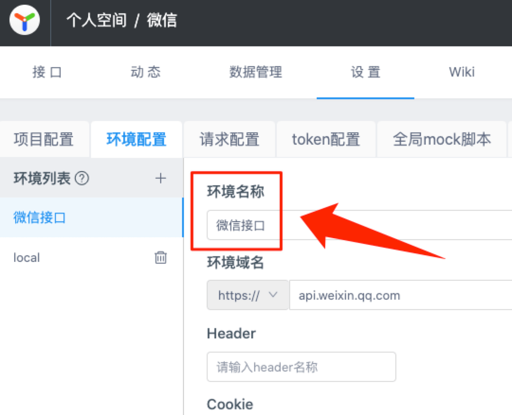
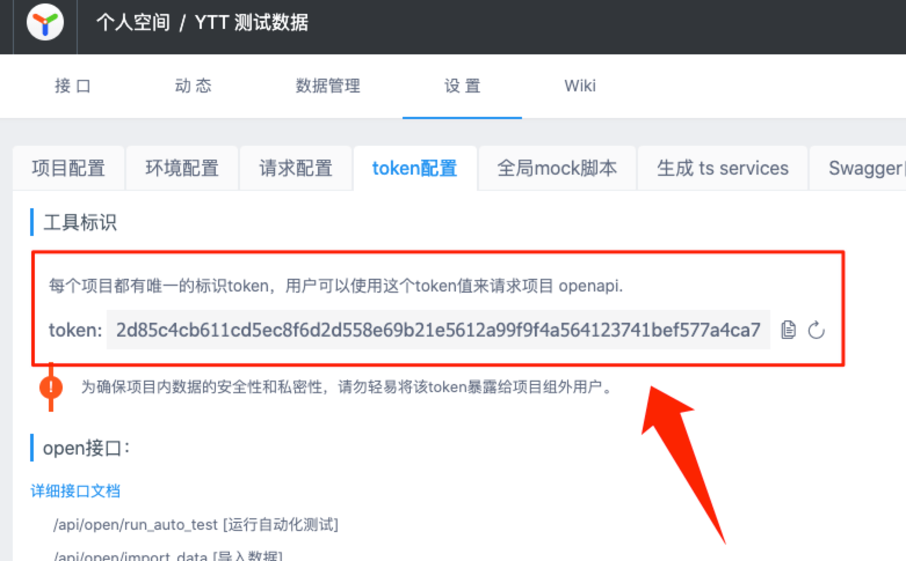

# 配置

首先，使用以下命令初始化配置文件：

```bash
npx ytt init
```

然后，打开 `ytt.config.ts` 或 `ytt.config.js` 文件进行配置。

## 公共配置

公共配置可以在[服务器级别](#服务器级别的配置)、[项目级别](#项目级别的配置)、[分类级别](#分类级别的配置)进行配置，如果存在相同的配置项，低级别的配置会覆盖高级别的配置。

### target

- 类型：`'typescript' | 'javascript'`
- 默认值：`'typescript'`
- 说明：

要生成的目标代码类型。

### typesOnly

- 类型：`boolean`
- 默认值：`false`
- 说明：

是否只生成接口请求内容和返回内容的 TypeSript 类型，是则请求文件和请求函数都不会生成。

### devEnvName

- 类型：`string`
- 默认值：`(无)`
- 说明：

测试环境名称。用于获取测试环境域名。

获取方式：打开项目 -> 设置 -> 环境配置 -> 点开或新增测试环境 -> 复制测试环境名称。



### prodEnvName

- 类型：`string`
- 默认值：`(无)`
- 说明：

生产环境名称。用于获取生产环境域名。

获取方式：打开项目 -> 设置 -> 环境配置 -> 点开或新增生产环境 -> 复制生产环境名称。


### outputFilePath

- 类型：`string`
- 默认值：`(必填)`
- 说明：

输出文件路径。可以是 `相对路径` 或 `绝对路径`。如 `'src/api/index.ts'`。

### requestFunctionFilePath

- 类型：`string`
- 默认值：`与 outputFilePath 同级目录下的 request.ts 文件`
- 说明：

请求函数文件路径。如 `'src/api/request.ts'`。

### dataKey

- 类型：`string`
- 默认值：`(无)`
- 说明：

比如接口返回的数据形如：

```json
{
  "code": 0,
  "msg": "success",
  "data": {
    "id": 1,
    "name": "周杰伦"
  }
}
```

作为具体业务，我们只关心 `data` 字段内的数据（`code`、`msg` 已经由请求函数统一处理），此时，可将 `dataKey` 设为 `data`，如此，生成的接口响应数据类型就是 `data` 字段的类型，必须注意的是，请求函数内需自行根据 `payload.dataKey` 返回具体业务所需的内容，如：

```typescript
import { RequestFunctionParams } from 'yapi-to-typescript'

export default async function request<TResponseData>(
  payload: RequestFunctionParams,
): Promise<TResponseData> {
  let res!: any

  // ...
  // 具体请求逻辑取得响应结果 res
  // ...

  return res != null &&
    typeof res === 'object' &&
    payload.dataKey != null &&
    res[payload.dataKey] != null
    ? res[payload.dataKey]
    : res
}
```

### reactHooks

- 类型：`object`
- 默认值：`(无)`
- 说明：

支持生成 React Hooks 代码的相关配置。

#### reactHooks.enabled

- 类型：`boolean`
- 默认值：`(必填)`
- 说明：

是否开启该项功能。

#### reactHooks.requestHookMakerFilePath

- 类型：`string`
- 默认值：`与 outputFilePath 同级目录下的 makeRequestHook.ts 文件`
- 说明：

请求 Hook 函数制造者文件路径。

#### reactHooks.getRequestHookName

- 类型：`(interfaceInfo: ExtendedInterface, changeCase: ChangeCase): string`
- 默认值：`(interfaceInfo, changeCase) => 'use' + changeCase.pascalCase(requestFunctionName)`
- 说明：

获取请求 Hook 的名称。

### jsonSchema

- 类型：`object`
- 默认值：`(无)`
- 说明：

支持生成 JSON Schema 的相关配置。

开启后可在请求函数内通过 `payload.requestDataJsonSchema`、`payload.responseDataJsonSchema` 分别取得请求数据、返回数据的 JSON Schema，可配合 [ajv](https://github.com/ajv-validator/ajv) 等库对请求数据、返回数据进行校验。

#### jsonSchema.enabled

- 类型：`boolean`
- 默认值：`(必填)`
- 说明：

是否开启该项功能。

#### jsonSchema.requestData

- 类型：`boolean`
- 默认值：`true`
- 说明：

是否生成请求数据的 JSON Schema。

#### jsonSchema.responseData

- 类型：`boolean`
- 默认值：`true`
- 说明：

是否生成返回数据的 JSON Schema。

### comment

- 类型：`object`
- 默认值：`(无)`
- 说明：

支持生成注释的相关配置。

#### comment.enabled

- 类型：`boolean`
- 默认值：`true`
- 说明：

是否开启该项功能。

#### comment.title

- 类型：`boolean`
- 默认值：`true`
- 说明：

是否有标题。

#### comment.category

- 类型：`boolean`
- 默认值：`true`
- 说明：

是否有分类名称。

#### comment.tag

- 类型：`boolean`
- 默认值：`true`
- 说明：

是否有标签。

#### comment.requestHeader

- 类型：`boolean`
- 默认值：`true`
- 说明：

是否有请求头。

#### comment.updateTime

- 类型：`boolean`
- 默认值：`true`
- 说明：

是否有更新时间。

#### comment.link

- 类型：`boolean`
- 默认值：`true`
- 说明：

是否为标题、分类名称添加链接。

### preproccessInterface

- 类型：`(interfaceInfo: Interface, changeCase: ChangeCase): Interface | false`
- 默认值：`(无)`
- 说明：

预处理接口信息，返回新的接口信息。可返回 false 排除当前接口。

- 应用场景 1：批量替换接口路径中的 v1 为 v2

  ```javascript
  import { defineConfig } from 'yapi-to-typescript'

  export default defineConfig({
    preproccessInterface(interfaceInfo) {
      interfaceInfo.path = interfaceInfo.path.replace('v1', 'v2')
      return interfaceInfo
    },
  })
  ```

- 应用场景 2：排除分类名称含「前台」的所有接口

  ```javascript
  import { defineConfig } from 'yapi-to-typescript'

  export default defineConfig({
    preproccessInterface(interfaceInfo) {
      if (interfaceInfo._category.name.includes('前台')) {
        return false
      }
      return interfaceInfo
    },
  })
  ```

### getRequestFunctionName

- 类型：`(interfaceInfo: ExtendedInterface, changeCase: ChangeCase): string`
- 默认值：`(interfaceInfo, changeCase) => changeCase.camelCase(interfaceInfo.parsedPath.name)`
- 说明：

获取请求函数的名称。

### getRequestDataTypeName

- 类型：`(interfaceInfo: ExtendedInterface, changeCase: ChangeCase): string`
- 默认值：`(interfaceInfo, changeCase) => changeCase.pascalCase(requestFunctionName + 'Request')`
- 说明：

获取请求数据类型的名称。

### getResponseDataTypeName

- 类型：`(interfaceInfo: ExtendedInterface, changeCase: ChangeCase): string`
- 默认值：`(interfaceInfo, changeCase) => changeCase.pascalCase(requestFunctionName + 'Response')`
- 说明：

获取响应数据类型的名称。

## 服务器级别的配置

### serverType

- 类型：`'yapi' | 'swagger'`
- 默认值：`'yapi'`
- 说明：

服务器类型。ytt 除了支持 YApi，还支持 Swagger，其原理在于内部实现了一个适配器，其自动抓取 Swagger 的定义并转换为 YApi 的定义，并用它们模拟一个 YApi 服务。

### serverUrl

- 类型：`string`
- 默认值：`(必填)`
- 说明：

服务器地址。

- 基于 YApi 的项目，此处填 YApi 首页地址，如 `https://yapi.baidu.com/`；
- 基于 Swagger 的项目，此处填其定义的 json 地址，如 `https://petstore.swagger.io/v2/swagger.json`。

### projects

- 类型：`Array`
- 默认值：`(必填)`
- 说明：

项目列表。

## 项目级别的配置

### token

- 类型：`string | string[]`
- 默认值：`(必填)`
- 说明：

项目的唯一标识。支持多个项目。对于基于 Swagger 的项目，置空即可。

获取方式：打开项目 -> 设置 -> token 配置 -> 复制 token。



### categories

- 类型：`Array`
- 默认值：`(必填)`
- 说明：

分类列表。

## 分类级别的配置

### id

- 类型：`number | number[]`
- 默认值：`(必填)`
- 说明：

分类 ID，可以设置多个。设为 `0` 时表示全部分类。

如果需要获取全部分类，同时排除指定分类，可以这样：`[0, -20, -21]`，分类 ID 前面的负号表示排除。

获取方式：打开项目 -> 点开分类 -> 复制浏览器地址栏 `/api/cat_` 后面的数字。


