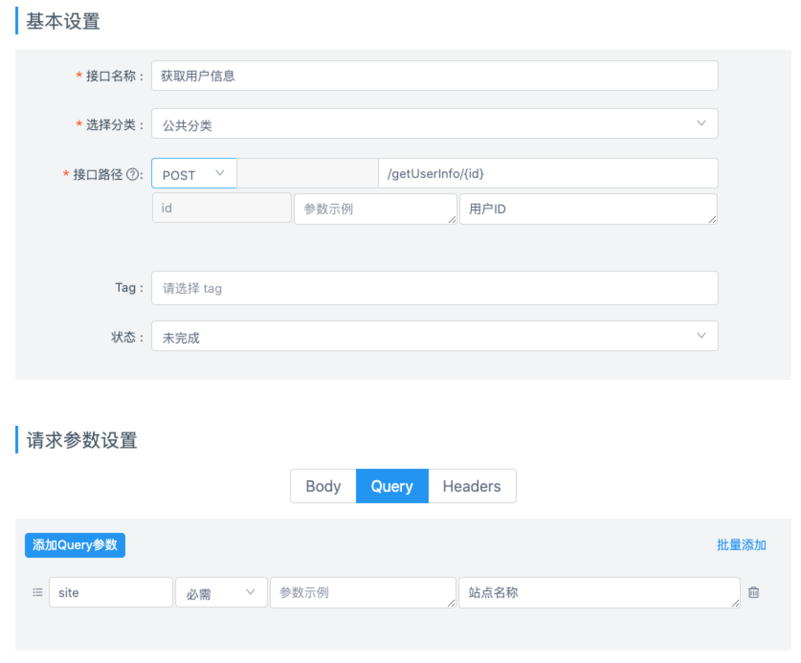

# 统一请求函数

统一请求函数统一接收各个接口的配置，并返回具体接口的响应结果。

统一请求函数文件路径可通过 [requestFunctionFilePath](/config.html#requestfunctionfilepath) 配置，该文件必须导出一个统一请求函数。

## 如何编写

默认导出一个异步的请求函数即可：

```typescript
import { RequestFunctionParams } from 'yapi-to-typescript'

export default async function request<TResponseData>(
  payload: RequestFunctionParams,
): Promise<TResponseData> {
  // ...
  // 基于 payload 获取接口信息，
  // 然后对接口发起请求，
  // 接着获取接口响应数据，
  // 并且根据 payload 的相关信息解析响应数据作为请求结果，
  // 最后返回请求结果。
  // ...
}
```

## 如何获取接口信息

统一请求函数内可通过第一个参数 `payload` 获取接口信息。

### mockUrl

- 类型：`string`
- 说明：

接口 Mock 地址，该地址根据接口 ID 自动生成，如：`https://my.yapi.server/mock/993`。

### devUrl

- 类型：`string`
- 说明：

接口测试环境地址，该地址根据配置 [devEnvName](/config.html#devenvname) 拉取，如：`https://my.dev.server/api/v2`。

### prodUrl

- 类型：`string`
- 说明：

接口生产环境地址，该地址根据配置 [prodEnvName](/config.html#prodenvname) 拉取，如：`https://my.prod.server/api/v2`。

### path

- 类型：`string`
- 说明：

接口路径，该路径以 YApi 上配置的接口路径为基准，首先将其中的路径参数替换为路径参数值，然后将接口的查询参数序列化为查询字符串附着在后面。举个例子：



对于上图所示的接口，如果你调用该接口请求函数时传参 `{ id: '120', site: 'weixin' }`，则 `path` 为：`/getUserInfo/120?site=weixin`。

### method

- 类型：`'GET' | 'POST' | 'PUT' | 'DELETE' | 'HEAD' | 'OPTIONS' | 'PATCH'`

  实际请这样使用：

  ```typescript
  import { Method } from 'yapi-to-typescript'

  console.log(Method.GET, Method.POST)
  ```

- 说明：

请求方法。

### requestBodyType

- 类型：`'query' | 'form' | 'json' | 'text' | 'file' | 'raw' | 'none'`

  实际请这样使用：

  ```typescript
  import { RequestBodyType } from 'yapi-to-typescript'

  console.log(RequestBodyType.form, RequestBodyType.json)
  ```

- 说明：

请求数据类型。

### responseBodyType

- 类型：`'json' | 'text' | 'xml' | 'raw'`

  实际请这样使用：

  ```typescript
  import { ResponseBodyType } from 'yapi-to-typescript'

  console.log(ResponseBodyType.text, ResponseBodyType.json)
  ```

- 说明：

返回数据类型。

### dataKey

- 类型：`string`
- 说明：

数据所在键，来自配置 [dataKey](/config.html#datakey)。

### dataKey

- 类型：`string`
- 说明：

数据所在键，来自配置 [dataKey](/config.html#datakey)。

### paramNames

- 类型：`string[]`
- 说明：

路径参数的名称列表。一般不用关心，路径参数值已经被预处理进了 [path](#path)。

### queryNames

- 类型：`string[]`
- 说明：

查询参数的名称列表。一般不用关心，查询参数键值已经被预处理进了 [path](#path)。

### requestDataJsonSchema

- 类型：`JSONSchema4`
- 说明：

请求数据的 JSON Schema，由配置 [jsonSchema](/config.html#jsonschema) 开启。

### responseDataJsonSchema

- 类型：`JSONSchema4`
- 说明：

返回数据的 JSON Schema，由配置 [jsonSchema](/config.html#jsonschema) 开启。

### data

- 类型：`object`
- 说明：

请求数据中的非文件数据。

### hasFileData

- 类型：`boolean`
- 说明：

请求数据中是否包含文件数据。

### fileData

- 类型：`object`
- 说明：

请求数据中的文件数据。

### getFormData

- 类型：`() => FormData`
- 说明：

如果这是一个涉及文件上传的接口，可通过 `getFormData()` 获取到 `FormData` 直接上传，该 `FormData` 内已经添加了 `data`、`fileData`。

## 基于浏览器 fetch 的示例

下面是一个基于浏览器原生 [fetch](https://developer.mozilla.org/zh-CN/docs/Web/API/Fetch_API) 的示例，通过 [cross-fetch](https://www.npmjs.com/package/cross-fetch)，你也可以让它运行在一些未实现 fetch 接口的老旧浏览器、Node.js、React Native 上。

```typescript
// TODO
```

## 基于小程序 request 的示例

下面是一个基于小程序原生 [request](https://developers.weixin.qq.com/miniprogram/dev/api/network/request/wx.request.html) 方法的示例，支持微信小程序、QQ 小程序、支付宝小程序、百度小程序、字节跳动小程序、钉钉小程序、京东小程序。

```typescript
// TODO
```
