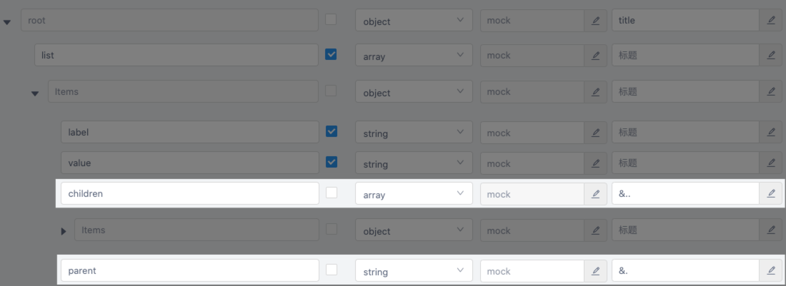
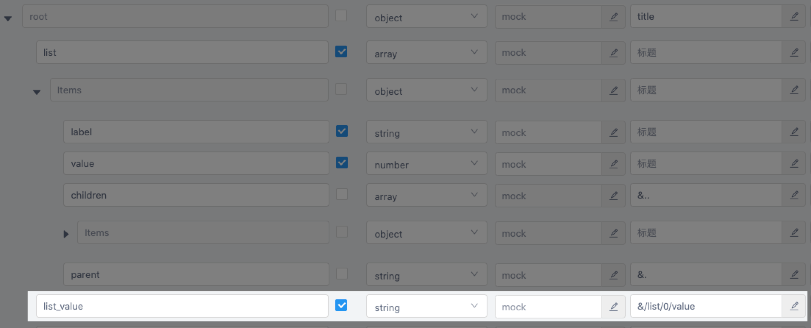

# 使用

## 生成代码

使用以下命令生成代码：

```bash
npx ytt
```

如果要使用自定义的配置文件：

```bash
npx ytt -c config/ytt.ts
```

## 编写统一请求函数

见[统一请求函数](./request.html)。

## 调用接口请求函数

从 [outputFilePath](./config.html#outputfilepath) 导入你要调用的接口请求函数即可，接口请求函数的名称由配置 [getRequestFunctionName](./config.html#getrequestfunctionname) 决定，如：

```typescript
import { getUserInfo } from '../api'

const updateUserInfo = async () => {
  const userInfo = await getUserInfo({
    id: 1,
  })
  console.log(userInfo)
}
```

## 调用上传文件类接口

对于上传文件类接口，你需要将文件包装为一个 FileData 实例，如：

```typescript
import { FileData } from 'yapi-to-typescript'
import { uploadFile } from '../api'

const changeAvatar = async (file: File) => {
  const res = await uploadFile({
    type: 'avatar',
    file: new FileData(file),
  })
  console.log(res)
}
```

## 获取接口的请求数据、返回数据类型

如果你没动过 [getRequestDataTypeName](./config.html#getrequestdatatypename)、[getResponseDataTypeName](./config.html#getresponsedatatypename) 这两个配置，默认情况下，你可以这样获取接口的请求数据、返回数据类型：

```typescript
import { getUserInfo, GetUserInfoRequest, GetUserInfoResponse } from '../api'

interface CustomUserInfo extends GetUserInfoResponse {
  gender: 'male' | 'female' | 'unknown'
}

const customGetUserInfo = async (
  payload: GetUserInfoRequest,
): Promise<CustomUserInfo> => {
  const userInfo = await getUserInfo(payload)
  return {
    ...userInfo,
    gender:
      userInfo.sexy === 1 ? 'male' : userInfo.sexy === 2 ? 'female' : 'unknown',
  }
}
```

如果你只想获得请求数据、返回数据下某个字段的类型，可以这样做：

```typescript
import { GetUserInfoResponse } from '../api'

type UserRole = GetUserInfoResponse['role']
```

## 命令行钩子 <Badge>3.31.0+</Badge>

可使用钩子在生成成功、失败、完毕时进行相关操作。

```typescript
import { defineConfig } from 'yapi-to-typescript'

export default defineConfig(
  {
    // 生成配置
  },

  // 钩子
  {
    success() {
      // 生成成功时触发
    },
    fail() {
      // 生成失败时触发
    },
    complete() {
      // 生成完毕时触发（无论成功、失败）
    },
  },
)
```

## 定义引用类型 <Badge>3.32.0+</Badge>

该功能适用于定义树等需要复用类型的场景。

YApi 本身是不支持定义引用类型的，本功能仅是在 YApi 自有功能上做了以下约定支持定义引用类型：

- 必须在 **标题** 栏定义（YApi 低版本没有 **标题** 栏，也可以在 **备注** 栏定义）；
- 必须以 **&** 开头；
- 引用路径规范和文件路径规范一致：`.` 表示当前级，`..` 表示上一级，`/` 在首位时表示根级，在中间时表示分割；
- 引用数组的条目时必须加上 `/0`；
- 定义引用类型后原本的类型定义将失效。

举例：

- 定义树

  

- 使用绝对路径引用

  

- 使用相对路径引用

  

- 引用数组条目

  
